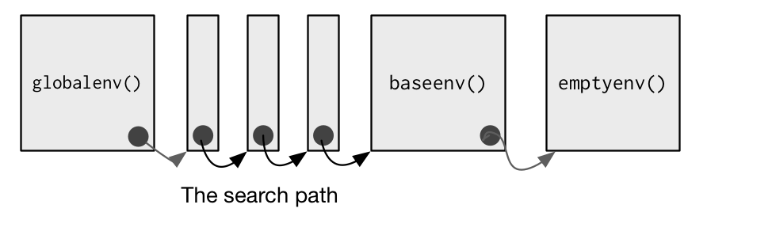

```{r,echo=FALSE,message=FALSE}
options(dplyr.print_min = 5)
library(tidyverse)
library(knitr)
```


## What do we want to be able to do?

The course provides a brief overview of R data structures followed by the following topics:

- Loops in R

- Vectorized functions (apply family of functions)

- How R functions work

- Function writing


## Writing Functions

- Knowing how to write functions vital to custom analyses!

- Function writing syntax  

```{r,eval=FALSE}
nameOfFunction <- function(input1, input2, ...) {
  #code
  #return something with return()
  #or returns last value
}
```


## Writing Functions

- Can look at code for functions  

```{r}
var
```

## Writing Functions

- Can look at code for functions  

```{r}
colMeans
```


## Writing Functions

- Can look at code for functions  

```{r}
mean
```  


## Writing Functions

- Can look at code for functions  

```{r}
mean.default
```


## Writing Functions

- Goal: Create a `standardize()` function  

- Take vector of values  

    * subtract mean  
    * divide by standard deviation  
    
- z-score idea  

- Formula: For value i,  
$$\frac{(value[i]-mean(value))}{sd(value)}$$


## Writing Functions

```{r,eval=FALSE}
nameOfFunction <- function(input1, input2, ...) {
  #code
  #return something with return()
  #or returns last value
}
```


```{r}
standardize <- function(vector) {
	return((vector - mean(vector)) / sd(vector))
}
```


## Writing Functions

- Now use it!  

```{r}
data <- runif(5)
data
result <- standardize(data)
result
```


## Writing Functions

- Check result has mean 0 and sd 1  

```{r}
mean(result)
sd(result)
```

## Writing Functions

- Goal: Add more inputs  
- Make centering optional  
- Make scaling optional  

```{r}
standardize <- function(vector, center, scale) {
	if (center) {
		vector <- vector - mean(vector)
	}
	if (scale) {
		vector <- vector / sd(vector)
	}
	return(vector)
}
```


## Writing Functions

```{r}
result <- standardize(data, center = TRUE, scale = TRUE)
result
result <- standardize(data, center = FALSE, scale = TRUE)
result
```


## Writing Functions

- Give center and scale default arguments  
```{r}
standardize <- function(vector, center = TRUE, scale = TRUE) {
	if (center) {
		vector <- vector - mean(vector)
	}
	if (scale) {
		vector <- vector / sd(vector)
	}
	return(vector)
}
```


## Writing Functions

```{r}
result <- standardize(data, center = TRUE, scale = TRUE)
result
result <- standardize(data)
result
```


## Writing Functions

- Return more than 1 object by returning a list  

- Goal: Also return  

    + `mean()` of original data  
    + `sd()` of original data  
    

## Writing Functions

```{r}
standardize <- function(vector, center = TRUE, scale = TRUE) {
	mean <- mean(vector)
	stdev <- sd(vector)
	if (center) {
		vector <- vector - mean
	}
	if (scale) {
		vector <- vector / stdev
	}
	return(list(vector, mean, stdev))
}
```


## Writing Functions  

```{r}
result <- standardize(data)
result  
result[[2]]
```


## Writing Functions

- Fancy up what we return by giving names  

```{r}
standardize <- function(vector, center = TRUE, scale = TRUE) {
	mean <- mean(vector)
	stdev <- sd(vector)
	if (center) {
		vector <- vector - mean
	}
	if (scale) {
		vector <- vector / stdev
	}
	return(list(result = vector, mean = mean, sd = stdev))
}
```

## Writing Functions  

```{r}
result <- standardize(data, center = TRUE, scale = TRUE)
result  
result$sd
```

## Quick Examples

- Go to the <a href = "https://jbpost2.github.io/Improving-R-Programs/CourseFiles.html">course files page</a> and try Exercise 4 - Basic Functions


## Writing Functions

- Can bring in unnamed arguments  
- Arguments that can be used by functions **inside** your function  

<div style = "float: left; width: 45%">
```{r}
mean
x <- c(rnorm(5), NA)
mean(x)
```
</div>

<div style = "float: right; width: 45%">
```{r}
mean(x, na.rm = TRUE)
```
</div>


## Writing Functions

- Can bring in unnamed arguments  
- Arguments that can be used by functions **inside** your function  

```{r}
plot
```
```{r, eval = FALSE}
plot(x = 1:5, y = (1:5)^2, type = "l", lty = "dashed")
```


## Writing Functions

```{r}
plot(x = 1:5, y = (1:5)^2, type = "l", lty = "dashed")
```

## Writing Functions

```{r}
plot.default
```


## Writing Functions

- Add unnamed arguments to our function for use with `sd()` and `mean()`  

```{r}
sd
mean.default
```


## Writing Functions

- Add unnamed arguments to our function for use with `sd()` and `mean()`  

```{r}
standardize <- function(vector, center = TRUE, scale = TRUE, ...) {
	mean <- mean(vector, ...)
	stdev <- sd(vector, ...)
	if (center) {
		vector <- vector - mean
	}
	if (scale) {
		vector <- vector / stdev
	}
	return(list(result = vector, mean = mean, sd = stdev))
}
```

## Writing Functions

```{r}
sData <- standardize(airquality$Ozone, na.rm = TRUE)
sData$sd
sData$result
```


## Writing Functions

- Note: You can get at the unnamed arguments with `list(...)`  

```{r}
f <- function(x, ...){
	unnamed <- names(list(...))
	unnamedVals <- list(...)
	modifyX <- x^2  
	return(list(newX = modifyX, elipNames = unnamed, elipValues = unnamedVals))
}
```


## Writing Functions

```{r}
f(x = 10, a = 1, b = "hey there", num = 1:3)
```


## Recap  

- Function writing opens R up!  

- Syntax  

```{r,eval=FALSE}
nameOfFunction <- function(input1, input2, ...) {
  #code
  #return something with return()
  #or returns last value
}
```

- Can set defaults in function definition  

- Can return a named list  

- Can give unnamed arguments for use  


## Naming conventions and input matching  

- Use of consistent naming schemes is important!  

- Objects  

    + must start with a letter  
    + can only have letters, numbers, `_`, and `.`  
    
    
## Naming conventions and input matching  

- Use of consistent naming schemes is important!  

- Objects  

    + must start with a letter  
    + can only have letters, numbers, `_`, and `.`  
    
- Functions usually verbs, data objects usually nouns   

- Naming schemes  

    + snake_case_used  
    + camelCaseUsed  
    + UpperCamelCase  
    + use.of.periods  


## Naming conventions and input matching  

- Also need to name inputs!  (From R for Data Science)  

    + x, y, z: vectors   
    + w: a vector of weights  
    + df: a data frame
    + i, j: numeric indices (typically rows and columns)
    + n: length, or number of rows
    + p: number of columns
    
Otherwise, consider matching names of arguments in existing R functions. For example, use `na.rm` to determine if missing values should be removed.


## Naming conventions and input matching  

- Consider the inputs of the `cor()` function  

```{r}
cor
```


## Naming conventions and input matching  

- Consider the inputs of the `cor()` function  

- Apply it to `iris` data...

```{r}
cor(iris$Sepal.Length, iris$Sepal.Width)
```

- Notice R doesn't require names: here it is using positional matching  

```{r, eval = FALSE}
function (x, y = NULL, use = "everything", method = c("pearson", 
    "kendall", "spearman")) 
```


## Naming conventions and input matching  

- Consider the inputs of the `cor()` function   

- Apply it to `iris` data...

```{r}
cor(x = iris$Sepal.Length, method = "spearman", iris$Sepal.Width)
```

- Positional match for inputs not explicitly called  

```{r, eval = FALSE}
function (x, y = NULL, use = "everything", method = c("pearson", 
    "kendall", "spearman")) 
```


## Naming conventions and input matching  

- Consider the inputs of the `cor()` function  

- Apply it to `iris` data...

```{r}
cor(x = iris$Sepal.Length, met = "spearman", iris$Sepal.Width)
```

- Partial matching is used if not exactly met!

```{r, eval = FALSE}
function (x, y = NULL, use = "everything", method = c("pearson", 
    "kendall", "spearman")) 
```


## `stop()` and `switch()`

To kick out of a function, you can use `stop()`  

```{r}
transposeDF <- function(df) {
	if(!is.data.frame(df)){
		stop("I want a data frame only!")
	}
	t(df)
}
transposeDF(iris)
```


## `stop()` and `switch()`

To kick out of a function, you can use `stop()`  

```{r, error = TRUE}
transposeDF <- function(df) {
	if(!is.data.frame(df)){
		stop("I want a data frame only!")
	}
	t(df)
}
transposeDF(as.matrix(iris))
```


## `stop()` and `switch()`

Often you want to check on inputs, can use `if()` or `switch()`
```{r}
center <- function(vec, type, ...) {
  if(!is.vector(vec)){
  	stop("Not a vector my friend.")
  }
	switch(type, 
				 mean = vec - mean(vec),
				 median = vec - median(vec),
				 trimmed = vec - mean(vec, ...),
				 stop("Mistake!")
	)
}
center(c(1,1,1,6,10), "mean")
```


## `stop()` and `switch()`

Often you want to check on inputs, can use `if()` or `switch()`
```{r}
center <- function(vec, type, ...) {
  if(!is.vector(vec)){
  	stop("Not a vector my friend.")
  }
	switch(type, 
				 mean = vec - mean(vec),
				 median = vec - median(vec),
				 trimmed = vec - mean(vec, ...),
				 stop("Mistake!")
	)
}
center(c(1,1,1,6,10), "median")
```

## `stop()` and `switch()`

Often you want to check on inputs, can use `if()` or `switch()`
```{r}
center <- function(vec, type, ...) {
  if(!is.vector(vec)){
  	stop("Not a vector my friend.")
  }
	switch(type, 
				 mean = vec - mean(vec),
				 median = vec - median(vec),
				 trimmed = vec - mean(vec, ...),
				 stop("Mistake!")
	)
}
center(c(1,1,1,6,10), "trimmed", trim = 0.2)
```


## `stop()` and `switch()`

Often you want to check on inputs, can use `if()` or `switch()`
```{r}
center <- function(vec, type, ...) {
	if(!is.vector(vec)){
		stop("Not a vector my friend.")
	}
	if(type == "mean"){
		vec - mean(vec)
	} else if (type =="median"){
		vec - median(vec)
	} else if (type =="trimmed") {
		vec - mean(vec, ...)
	} else {
		stop("Mistake!")
	}
}
center(c(1,1,1,6,10), "trimmed", trim = 0.2)
```

## Quick Examples 

- Go to the <a href = "https://jbpost2.github.io/Improving-R-Programs/CourseFiles.html">course files page</a> and try Exercise 5 - More Functions


## Writing Pipeable functions  

- Two types of pipeable functions:  

    1. **transformations**  
    2. **side-effects**  
    

## Pipeable functions  

- Two types of pipeable functions:  

    1. **transformations**  
    2. **side-effects**  

- transformations naturally return the modified argument (df)  

> - side-effects don't - usually a plot, saving a file, etc.

> - can silently return df with `invisible()`  


## Pipeable functions  

- Two types of pipeable functions:  

    1. **transformations**  
    2. **side-effects**  

```{r, error = TRUE}
printNumObs <- function(df) {
	cat("The number of observations in the data set is ", nrow(df), "\n", sep = "")
}
iris %>% printNumObs %>% summarize(mean = mean(Sepal.Length))
```

## Pipeable functions  

- Two types of pipeable functions:  

    1. **transformations**  
    2. **side-effects**  

```{r}
printNumObs <- function(df) {
	cat("The number of observations in the data set is ", nrow(df), "\n", sep = "")
	invisible(df)
}
iris %>% printNumObs %>% summarize(mean = mean(Sepal.Length))
```


## Pipeable functions  

```{r}
printNumObs <- function(df) {
	cat("The number of observations in the data set is ", nrow(df), "\n", sep = "")
	invisible(df)
}
temp <- printNumObs(iris)
str(temp)
```


## Infix functions  

- Speaking of pipes...  

- Infix function - a function that goes between arguments (as opposed to prefix)

```{r}
mean(3:5) #prefix
3 + 5 #+ is infix
`+`(3, 5) #used as a prefix function
```


## Infix functions  

- Infix function - a function that goes between arguments (as opposed to prefix)

- Common *built-in* infix functions include: `::`, `$`, `^`, `*`, `/`, `+`, `-`, `>`, `>=`, `<`, `<=`, `==`, `!=`, `&`, `|`, `<-`  

- Others use `%symbol%` syntax: `%*%` (matrix multiplication), `%in%` (check if LHS value(s) is(are) *in* RHS value(s)  

- Can call like prefix functions  

<div style = "float: left; width: 45%">
```{r}
cars <- as.matrix(cars)
t(cars) %*% cars
```
</div>

<div style = "float: right; width: 45%">
```{r}
`%*%`(t(cars), cars)
```
</div>


## Infix functions  

- Infix function - a function that goes between arguments (as opposed to prefix)

- Can write your own!

```{r}
`%+%` <- function(a, b) paste0(a, b)
"new" %+% " string"
```

- Can overwrite `+` and other operators: just don't do that...


## Infix functions  

- Infix function - a function that goes between arguments (as opposed to prefix)

- Can use precendence rules to save typing

```{r, error = TRUE, eval = FALSE}
x <- y <- 2
`<-`(x, `<-`(y, 2)) #interpretation of above code!

x <- y = 2# error! <- has higher precedence
`=`(`<-`(x, y), 2) #interpretation of above code!

x = y <- 2 # this will work!
`=`(x, `<-`(y, 2)) #interpretation of above code!
```


## Infix functions  

- Infix function - a function that goes between arguments (as opposed to prefix)

- Can use precendence rules to save typing

```{r}
`%-%` <- function(a, b) {
	paste0("(", a, " %-% ", b, ")")
}
"a" %-% "b" %-% "c" #user defined infix are evaluated left to right!
`%-%`(`%-%`("a", "b"), "c")  #interpretation of above code!
```


## Environments and Lexical Scoping

- R objects live in an environment  

- You can think of it as a "bag of names" that point to things in memory  

- Like a list but with no ordering (and other things)  


## Environments and Lexical Scoping  

- Environments have 'parents' and 'children'  

    + Global environment is where our created function objects live  

    + Search path has all packages loaded in (most recent package is the parent of the global environment) 
    
    + base environment is the child of the ultimate ancestor, the empty environment  

```{r, out.width=800, echo = FALSE}

```


## Environments and Lexical Scoping  

- Environments have 'parents' and 'children'  

    + Global environment is where our created function objects live  

    + Search path has all packages loaded in (most recent package is the parent of the global environment) 
    
    + base environment is the child of the ultimate ancestor, the empty environment  

```{r, out.width=800, echo = FALSE}
search()
```


## Environments and Lexical Scoping  

- Don't need to fully understand them... a few important things to know  

```{r, message = FALSE, warning = FALSE}
library(pryr) #install if needed
x <- "hey"
where("x")
where("mean")
```


## Environments and Lexical Scoping  

- When you call a function, it creates temporary function environments  

- This is why variables in functions don't overwrite things (mean still exists as is!)  
```{r}
f <- function(x){
	mean <- paste0(x, " is a value")
	mean
}
f(1:3)
mean
```


## Environments and Lexical Scoping  

- When you call a function, it creates temporary function environments  

<div style = "float: left; width: 45%">
```{r}
g <- function(x) {
  if (!exists("a", inherits = FALSE)) {
    message("Defining a")
    a <- 1
  } else {
    a <- a + 1
  }
  a
}
```
</div>
<div style = "float: right; width: 45%">
```{r}
#Running the function doesn't create 
#the a object in our global environment!
g(10)
g(10)
```
</div>

## Environments and Lexical Scoping  

- When you call a function, it creates temporary function environments  

- This is why variables can have the same name in a function and in your global environment  

```{r}
y <- 10
f <- function(x){
	y <- 1
	x + y
}
f(15)
```


## Environments and Lexical Scoping  

- If R doesn't find an object in the current environment, it will search up the path  

```{r}
y <- 1
f <- function(x){
	x + y
}
f(10)
```

- Much more to it, but this should give you a strong foundation  


## Quick Examples

- Go to the <a href = "https://jbpost2.github.io/Improving-R-Programs/CourseFiles.html">course files page</a> and try Exercise 6 - Last Functions