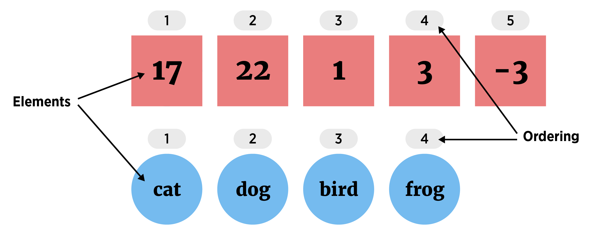

```{r,echo=FALSE, message = FALSE, warning = FALSE}
library(tidyverse)
library(knitr)
options(dplyr.print_min = 5)
```


## What do we want to be able to do?

The course provides a brief overview of R data structures followed by the following topics:

- Loops in R

- Vectorized functions (apply family of functions)

- How R functions work

- Function writing

First up, recap and streamline repeated sections of code!


## Review of Data Structures in R

- Five major types  

     1. Atomic Vector (1d)  
     2. Matrix (2d)  
     3. Array (nd)  
     4. Data Frame (2d)  
     5. List (1d)  


Dimension | Homogeneous   | Heterogeneous
--------- | ------------- | -------------
1d        | Atomic Vector | List
2d        | Matrix        | Data Frame

## Vector   

Atomic Vector (1D group of elements with an ordering)   

```{r vectorVis, echo = FALSE, fig.align='center', out.width = '650px', echo = FALSE}

```

- Elements must be same 'type'  

    + numeric (integer or double), character, or logical
    
## Accessing Parts of an Atomic Vector (1D)

- Return elements using square brackets `[]`   

- Can 'feed' in a vector of indices to `[]`  

```{r indexVec2}
letters
letters[1:4]
x <- c(1, 2, 5); letters[x]
```


## Data Frames 

- Best R object for data sets
- Collection (list) of vectors of the same **length**

```{r, echo = FALSE, fig.align='center', out.width = '500px', echo = FALSE}
knitr::include_graphics("../img/dfVisualF.png")
```


## Data Frames

- Consider the built in `iris` data set

- Can see info about object with `str()`

```{r}
myIris <- as_tibble(iris)
str(myIris)
```


## Accessing Parts of Data Frame (2D) 

- Returning rectangular portions of a data frame

```{r}
myIris[1:4, 2:4]
myIris[1, ]
```

## Accessing Parts of Data Frame (2D) 

- Grabbing a column (same result for both)

```{r, eval =FALSE}
myIris$Sepal.Length
```

```{r}
dplyr::pull(myIris, Sepal.Length)
```


## Data Frames  

- Grabbing multiple columns 

```{r}
dplyr::select(myIris, starts_with("Sepal"))
```


## Packages & `tidyverse`  

 - "[TidyVerse](http://tidyverse.org/)" - collection of R packages that share common philosophies and are designed to work together!  

- If not installed (downloaded) on computer

```{r,eval=FALSE}
install.packages("tidyverse")
```

- Once installed, `library()` or `require()` to load
```{r, eval = FALSE}
library(tidyverse)
```    

> - `dplry` package made for most standard data manipulation tasks   

> - `tidyr` handles most of the rest  

> - `%>%` operator allows coding from left to right  


## Pipe  

- Generically, pipe does the following

`x %>% f(y)` turns into `f(x,y)`  

`x %>% f(y) %>% g(z)` turns into `g(f(x, y), z)`  

```{r}
library(Lahman) #Install pacakage if needed
Batting %>% 
  as_tibble() %>% 
  select(starts_with("X"), ends_with("ID"), G) %>% 
  rename("Doubles" = X2B, "Triples" = X3B)
```

## Streamlining Code  

On to the main attraction!  Improving R code!  

- Often a repetitive task must be done  

- Task requires a small change each time it is done  

Example:  

- Summarize each column of a dataset  


## Summarizing columns  

Consider wine data from [UCI machine learning repository](https://archive.ics.uci.edu/ml/datasets/wine+quality)  

```{r, message = FALSE}
wineData <- read_csv("../datasets/winequality-full.csv")
wineData
```


## Summarizing Columns  

- Of course R has some nice functions to help us out... 

```{r}
summary(wineData)
```


## Custom Column Summary - Hard Way

- Print out mean, median, and trimmed mean for each (numeric) column

```{r}
#fixed acidity
c(Mean = mean(wineData$`fixed acidity`), 
  Median = median(wineData$`fixed acidity`), 
  TrimmedMean = mean(wineData$`fixed acidity`, 0.05))
#volatile acidity
c(Mean = mean(wineData$`volatile acidity`), 
  Median = median(wineData$`volatile acidity`), 
  TrimmedMean = mean(wineData$`volatile acidity`, 0.05))
#...
```

## Custom Column Summary

Instead use a **Loop**!  

- `for loops` or `while loops` commonly used in R

- `for loop` syntax

```{r,eval=FALSE}
for(index in values){
  code to be run
}
```

## For Loops - Index  

- index defines 'counter' or variable that varies

<div style = "float: left; width: 45%">
```{r}
for (index in 1:10){
  print(index)
}
```
</div>
<div style = "float: right; width: 45%">
```{r}
for (i in c("cat", "dog", "wolf")){
  print(i)
}
```
</div>


## For Loops - Values 

- 'values' define which values index takes on

<div style = "float: left; width: 45%">
```{r}
values <- 1:10
for (index in values){
  print(index)
}
```
</div>
<div style = "float: right; width: 45%">
```{r}
for (i in seq_along(iris)){
  print(names(iris)[i])
}
```
</div>


## Custom Column Summary

- Print out mean, median, and trimmed mean for each (numeric) column

```{r}
for(i in 1:12){ #first 12 columns are numeric
  colData <- pull(wineData, i)
  print(names(wineData)[i])
  print(c(Mean = mean(colData),
          Median = median(colData),
          TrimmedMean = mean(colData, 0.05))
  )
}
```


## Custom Column Summary

- Might store the results for later use

```{r}
ncols <- ncol(wineData)
sumDF <- data.frame(varName = names(wineData)[-ncols], 
                    mean = numeric(ncols-1), 
                    median = numeric(ncols-1), 
                    trimmedMean = numeric(ncols-1)
                    )
sumDF
```


## Custom Column Summary

- Fill in each row as you go

```{r}
for(i in seq_along(wineData)[-ncols]){
  colData <- pull(wineData, i)
  sumDF[i, 2:4] <- c(mean(colData), median(colData), mean(colData, 0.05))
}
sumDF
```

## `while` Loops

- `while` loop similar to `for` loops

```{r, eval = FALSE}
while(condition) {
	expression to evaluate
  modify condition to FALSE?
}
```


## `break` Out of a Loop

- `break` exits a loop

```{r}
for (i in 1:5){
	if (i == 4){ 
	  break 
	  }
  print(i)
}
```


## `next` to Skip  

- `next` jumps to the next iteration of the loop  

```{r}
for (i in 1:5){
	if (i == 3){
	  next
	} 
  print(i)
}
```


## Quick Examples  

- Go to the <a href = "https://jbpost2.github.io/Improving-R-Programs/CourseFiles.html">course files page</a> and try Exercise 1 - Loops


## Looping in R  

For loops inefficient in R  

> + R interpreted language  

> + Must figure out how to evaluate code at each iteration of loop  

> + Slows it down  


## Looping in R  

For loops inefficient in R  

 + R interpreted language  

 + Must figure out how to evaluate code at each iteration of loop  
 
 + Slows it down  

Vectorized functions much faster!  

> + Vectorized function: works on entire vector at once  

> + Avoids costly computation time  
   


## Efficient Code  

Some 'built-in' vectorized functions    

> + `colMeans()`, `rowMeans()`
> + `colSums()`, `rowSums()`
> + `colSds()`, `colVars()`, `colMedians()` (`matrixStats` package)
> + `ifelse()`, `dplyr::if_else()`
> + `apply()` family

> + Create your own with `Vectorize()`


## `colMeans` - Find Column Means

- `colMeans()` just requires a numeric data frame (array)

```{r}
wineData %>% 
  select(-type) %>% 
  colMeans()
```


## Compare computational time  

- `microbenchmark` package allows for easy recording of computing time

```{r,eval=FALSE}
install.packages("microbenchmarK")
```
```{r}
library(microbenchmark)
```


## Compare computational time  

```{r}
wineData2 <- wineData %>% select(-type)
microbenchmark(colMeans(wineData2), unit = "ms")
microbenchmark(for(i in 1:12){mean(wineData[[i]])}, unit = "ms")
```


## `colMedians` - column medians 

- `matrixStats::colMedians()` just requires a numeric data frame (array)

```{r, message = FALSE}
library(matrixStats)
wineData %>% 
  select(-type) %>%
  as.matrix() %>%
  colMedians()
```


## Creating a New Variable

Want to code a new categorical quality variable    

 + Poor (quality $\leq$ 3)  
 + Ok (3 $<$ quality $\leq 5$)
 + Good (5 $<$ quality $\leq$ 7)
 + Great (7 $<$ quality $\leq$ 10)

> - Initial plan: loop through each observation and use `if` `then` `else`


## Inefficient Code

```{r}
#initialize vector to save results
qualityCat <- character()

for (i in 1:(dim(wineData)[1])){
  if(wineData$quality[i] <= 3){
    qualityCat[i] <- "Poor"
  } else if(wineData$quality[i] <= 5){
    qualityCat[i] <- "Ok"
  } else if(wineData$quality[i] <= 7){
    qualityCat[i] <- "Good"
  } else if(wineData$quality[i] <= 10){
    qualityCat[i] <- "Great"
  } else {
    qualityCat[i] <- "Error"
  }
}
```

## Inefficient Code

```{r}
wineData$qualityCat <- qualityCat
wineData %>% select(qualityCat, quality, everything())
```


## Efficiency  

- Know for loops not great  

- `if_else()` (or `ifelse()`) is vectorized version of `if then else`

- Syntax

```{r,eval=FALSE}
if_else(vector_condition, if_true_do_this, if_false_do_this)
```


## Back to the Code  

- Know for loops not great  

- `if_else()` (or `ifelse()`) is vectorized version of `if then else`

- Syntax

```{r,eval=FALSE}
if_else(vector_condition, if_true_do_this, if_false_do_this)
```

```{r}
qualityCat <- if_else(wineData$quality <= 3, "Poor",
                  if_else(wineData$quality <= 5, "Ok",
                        if_else(wineData$quality <= 7, "Good",
                            if_else(wineData$quality <= 10, "Great", "Error"))))
```


## Compare speed

```{r}
loopTime<-microbenchmark(
  for (i in 1:(dim(wineData)[1])){
    if(wineData$quality[i] <= 3){
      qualityCat[i] <- "Poor"
    } else if(wineData$quality[i] <= 5){
      qualityCat[i] <- "Ok"
    } else if(wineData$quality[i] <= 7){
      qualityCat[i] <- "Good"
    } else if(wineData$quality[i] <= 10){
      qualityCat[i] <- "Great"
    } else {
      qualityCat[i] <- "Error"
    }
  }
, unit = "us")
```


## Compare speed

```{r}
vectorTime <- microbenchmark(
    if_else(wineData$quality <= 3, "Poor",
        if_else(wineData$quality <= 5, "Ok",
            if_else(wineData$quality <= 7, "Good",
                if_else(wineData$quality <= 10, "Great", "Error"))))
, unit = "us")
```

## Efficient Code

```{r}
loopTime
vectorTime
```


## `dplyr` to Summarize Data

- `group_by()` and `summarize()` great for quick summaries  

- Find mean alcohol for each quality category

```{r}
wineData %>% 
  group_by(qualityCat, type) %>% 
  summarize(meanAlcohol = mean(alcohol))
```


## `dplyr` to Summarize Data  

- `group_by()` and `mutate()` provide a nice way to add to a dataframe

```{r}
wineData %>% 
  group_by(qualityCat, type) %>%
  mutate(meanAlcoholCat = mean(alcohol)) %>%
  select(meanAlcoholCat, qualityCat, type, alcohol, everything())
```


## Quick Examples

- Go to the <a href = "https://jbpost2.github.io/Improving-R-Programs/CourseFiles.html">course files page</a> and try Exercise 2 - if else

## Efficient Code  

Some 'built-in' vectorized functions    

 + `colMeans()`, `rowMeans()`
 + `colSums()`, `rowSums()`
 + `colSds()`, `colVars()`, `colMedians()` (`matrixStats` package)
 + `ifelse()`, `dplyr::if_else()`
 + `apply()` family

 + Create your own with `Vectorize()`


## `apply()` family

- `apply()` family of functions *pretty* fast

> - We'll look at `apply()`, `lapply()`, `sapply()`, and `replicate()`


## `apply()` family

 - Use `apply()` to find summary for columns of wine data

```{r}
apply(X = wineData %>% select(-type, -qualityCat),
      MARGIN = 2, 
      FUN = summary, 
      na.rm = TRUE)
```


## `lapply` 

- `lapply()` to apply a function to a list

- Create a list object  

```{r}
myList <- list(
  norm = rnorm(100),
  unif = runif(25),
  gamma = rgamma(500, rate = 1, shape = 1)
)
```


## `lapply` 

- Apply `mean()` function to each list element

```{r}
lapply(X = myList, FUN = mean)
```


## `sapply` 

- Use `sapply()` similar but returns a vector if possible

```{r}
sapply(X = myList, FUN = mean)
```


## `replicate`  

- `replicate()` function great for repeatedly running code  

- Estimate a probability using repeated simulations  

- Suppose you select five letters at random.  What is the probability none are repeated?  

```{r}
sample(size = 5, letters, replace = TRUE)
sample(size = 5, letters, replace = TRUE)
```

## `replicate`  

- Suppose you select five letters at random.  What is the probability none are repeated?  

```{r}
set.seed(1)
sample(size = 5, letters, replace = TRUE) %>% 
  unique()
set.seed(1)
sample(size = 5, letters, replace = TRUE) %>% 
  unique() %>% 
  length()
```


## `replicate`  

- Suppose you select five letters at random.  What is the probability none are repeated?  

```{r}
set.seed(1)
sample(size = 5, letters, replace = TRUE) %>% 
  unique() %>% 
  length() == 5
```


## `replicate`  

- Suppose you select five letters at random.  What is the probability none are repeated?  

```{r}
replicate(5, 
  sample(size = 5, letters, replace = TRUE) %>% 
    unique() %>% 
    length() == 5
)
```

## `replicate`  

- Suppose you select five letters at random.  What is the probability none are repeated?  

```{r}
replicate(50000, 
  sample(size = 5, letters, replace = TRUE) %>% 
    unique() %>% 
    length() == 5
) %>% 
  mean()
```


## Recap!

- Vectorized functions fast!

- 'Built-in' vectorized functions  
    + `colMeans()`, `rowMeans()`
    + `colSums()`, `rowSums()`
    + `colSds()`, `colVars()`, `colMedians()` (`matrixStats` package)
    + `ifelse()` 
    + `apply()` family


## Quick Examples

- Go to the <a href = "https://jbpost2.github.io/Improving-R-Programs/CourseFiles.html">course files page</a> and try Exercise 3 - apply